# Security-Controlled Infrastructure Deployment with Terraform & Conftest

## Project Overview

Infrastructure as Code (IaC) makes it easier to deploy infrastructure consistently and repeatedly. However, without preventive security controls, Terraform can also automate insecure configurations at scale.

This project demonstrates how to build a **security-controlled Terraform deployment workflow** that validates infrastructure against custom security policies before deployment.

The project uses **reusable Terraform modules** to standardize infrastructure and **Conftest with OPA/Rego** to enforce security policies against the Terraform plan.

The workflow is designed to detect and block common security misconfigurations such as:

* SSH access exposed to `0.0.0.0/0`
* IAM policies using unrestricted `Action = "*"` and `Resource = "*"`
* S3 buckets without server-side encryption

The project also includes intentional misconfiguration testing to verify that each security policy can successfully detect a violation before Terraform applies the changes.

### Core Workflow

```text
Terraform Configuration
        ↓
Reusable Terraform Modules
        ↓
Terraform Plan
        ↓
Convert Plan to JSON
        ↓
Conftest / OPA Policy Validation
        ↓
   ┌───────────────┐
   │               │
 PASS ✅          FAIL ❌
   │               │
   ↓               ↓
Apply Plan       Block Deployment
```

### Project Goal

The goal is to move security controls **earlier in the infrastructure deployment lifecycle**, changing the approach from:

> Detect insecure infrastructure after deployment

to:
> **Prevent insecure infrastructure before deployment**.

## Phase 1 — Define Security Requirements

### Objective

Before building Terraform modules or policy enforcement, the security requirements must be clearly defined.

The goal of this phase is to establish a **security baseline** that later becomes the foundation for the Conftest policies.

---

### Step 1 — Define Protected Resources

The project focuses on three security areas:

```text
Security Group
IAM
Amazon S3
```

Each area represents a security control that will be enforced before Terraform deployment.

---

### Step 2 — Define Security Group Requirement

The first requirement is to prevent publicly exposed administrative access.

**Requirement:**

> SSH (TCP/22) must not be exposed to `0.0.0.0/0`.

Allowed example:

```text
TCP 22 → Trusted CIDR
```

Prohibited example:

```text
TCP 22 → 0.0.0.0/0
```

This control helps reduce unnecessary exposure of administrative access.

---

### Step 3 — Define IAM Requirement

The second requirement focuses on excessive permissions.

**Requirement:**

> IAM policies must not allow `Action = "*"` together with `Resource = "*"`.

Prohibited example:

```json
{
  "Effect": "Allow",
  "Action": "*",
  "Resource": "*"
}
```

The project uses a more restrictive permission model based on the principle of least privilege.

---

### Step 4 — Define S3 Requirement

The third requirement ensures encryption is enabled for S3 buckets.

**Requirement:**

> S3 buckets must have server-side encryption configured.

The Terraform implementation will use:

```text
S3 Bucket
    ↓
Server-Side Encryption
    ↓
AES256
```


---

### Step 5 — Create the Security Baseline

All requirements are documented in:

```text
security-requirements.md
```

Current baseline:

| Resource       | Security Requirement                    |
| -------------- | --------------------------------------- |
| Security Group | Block public SSH                        |
| IAM            | Block `Action = "*"` + `Resource = "*"` |
| S3             | Require server-side encryption          |

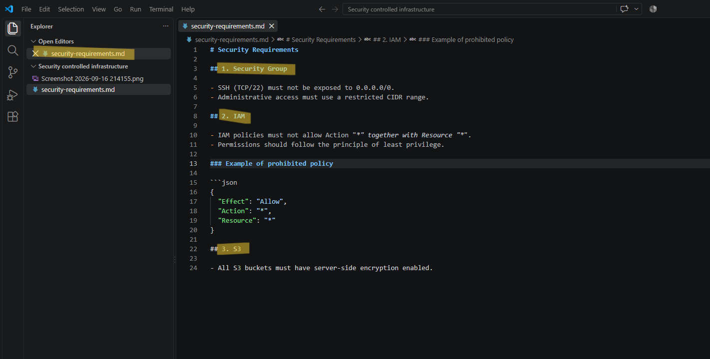
---

### Step 6 — Define Expected Policy Behavior

Each requirement needs an expected result so it can later be tested with Conftest.

| Test Case                         | Expected Result |
| --------------------------------- | --------------- |
| SSH from `0.0.0.0/0`              | ❌ FAIL          |
| SSH from trusted CIDR             | ✅ PASS          |
| IAM `Action="*"` + `Resource="*"` | ❌ FAIL          |
| IAM specific action/resource      | ✅ PASS          |
| S3 without encryption             | ❌ FAIL          |
| S3 with encryption                | ✅ PASS          |

This creates a clear relationship between the requirement and the future policy enforcement.

---

### Phase 1 Result

At the end of this phase, the project has a documented security baseline:

```text
Security Requirements
        ↓
Security Group
IAM
S3
        ↓
Expected PASS / FAIL Behavior
        ↓
Foundation for Policy as Code
```
---

# Phase 2 — Build Reusable Terraform Modules

## Objective

The goal of this phase is to create **reusable Terraform modules** that standardize how infrastructure is provisioned.

Instead of placing all resources in a single Terraform file, the infrastructure is separated into dedicated modules:

```text
modules/
├── vpc/
├── security-group/
├── iam/
└── s3/
```

Each module follows the same structure:

```text
main.tf
variables.tf
outputs.tf
```

This makes the infrastructure easier to reuse, maintain, and apply consistently across environments.

---

## Step 1 — Create Module Structure

Create the following directory structure:

```text
modules/
├── vpc/
│   ├── main.tf
│   ├── variables.tf
│   └── outputs.tf
│
├── security-group/
│   ├── main.tf
│   ├── variables.tf
│   └── outputs.tf
│
├── iam/
│   ├── main.tf
│   ├── variables.tf
│   └── outputs.tf
│
└── s3/
    ├── main.tf
    ├── variables.tf
    └── outputs.tf
```
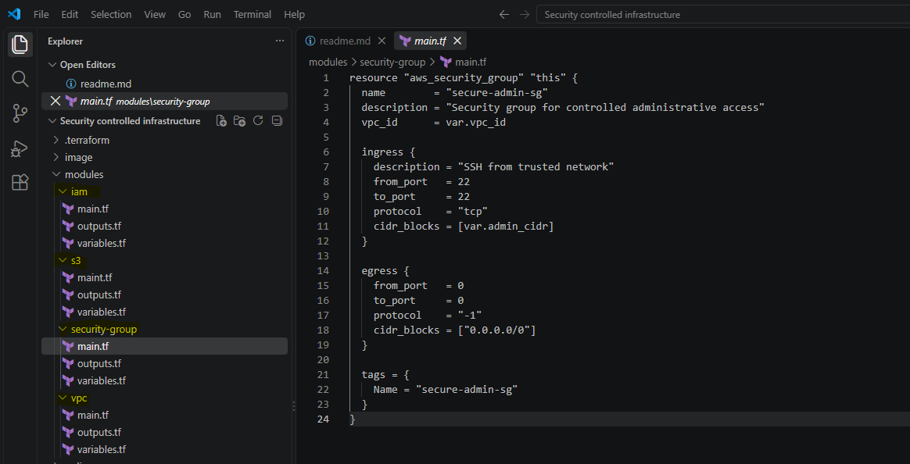
---

## Step 2 — Build the VPC Module

The VPC module provisions the network foundation.

### `variables.tf`

```hcl
variable "vpc_cidr" {
  type        = string
  description = "CIDR block for the VPC"
}
```

### `main.tf`

```hcl
resource "aws_vpc" "this" {
  cidr_block = var.vpc_cidr

  tags = {
    Name = "security-controlled-vpc"
  }
}
```

### `outputs.tf`

```hcl
output "vpc_id" {
  value = aws_vpc.this.id
}
```

The module accepts a CIDR as input and exposes the VPC ID as an output.

---

## Step 3 — Build the Security Group Module

The Security Group module implements the network access requirement defined in Phase 1.

### Inputs

```hcl
variable "vpc_id" {
  type        = string
  description = "VPC ID where the security group will be created"
}

variable "admin_cidr" {
  type        = string
  description = "Trusted CIDR allowed to access SSH"
}
```

The SSH rule uses the supplied trusted CIDR rather than allowing public access:

```hcl
ingress {
  description = "SSH from trusted network"
  from_port   = 22
  to_port     = 22
  protocol    = "tcp"
  cidr_blocks = [var.admin_cidr]
}
```

This provides a reusable security-controlled Security Group module.

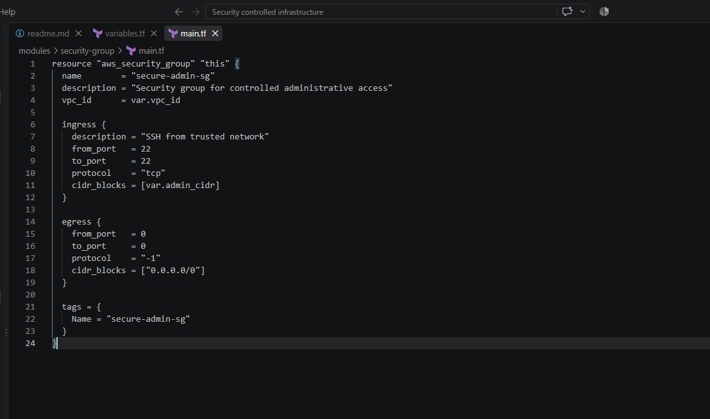
---
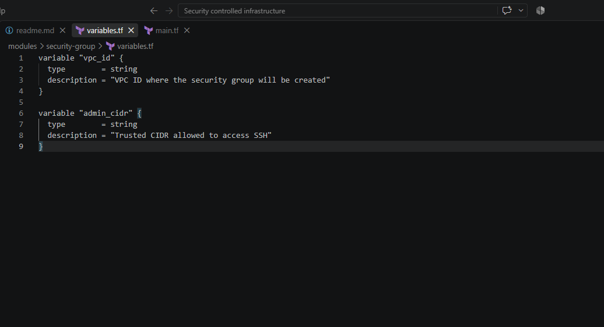
---

## Step 4 — Build the IAM Module

The IAM module creates an IAM role and a restricted inline policy.

The policy intentionally grants only the required S3 permission:

```hcl
Action = [
  "s3:GetObject"
]

Resource = "${var.bucket_arn}/*"
```

This avoids the prohibited pattern:

```text
Action   = "*"
Resource = "*"
```

The module receives the S3 bucket ARN as an input.

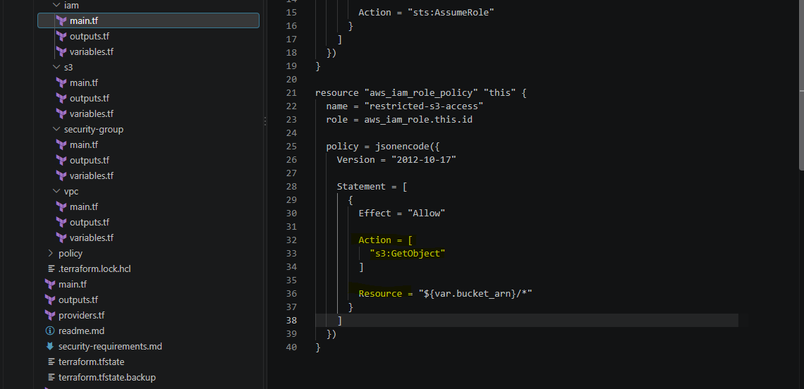
---

## Step 5 — Build the S3 Module

The S3 module creates the bucket and its server-side encryption configuration.

```hcl
resource "aws_s3_bucket_server_side_encryption_configuration" "this" {
  bucket = aws_s3_bucket.this.id

  rule {
    apply_server_side_encryption_by_default {
      sse_algorithm = "AES256"
    }
  }
}
```

The encryption requirement from Phase 1 is therefore built directly into the reusable module.

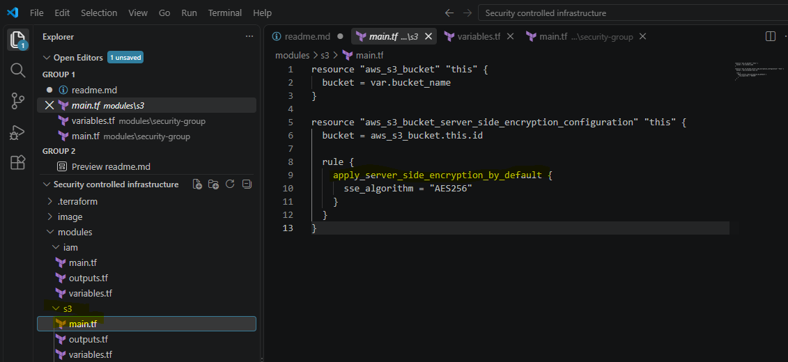
---

## Step 6 — Create the Root Terraform Configuration

The root module connects the reusable modules together.

```hcl
module "vpc" {
  source = "./modules/vpc"

  vpc_cidr = var.vpc_cidr
}

module "security_group" {
  source = "./modules/security-group"

  vpc_id     = module.vpc.vpc_id
  admin_cidr = var.admin_cidr
}

module "s3" {
  source = "./modules/s3"

  bucket_name = var.bucket_name
}

module "iam" {
  source = "./modules/iam"

  bucket_arn = module.s3.bucket_arn
}
```

This demonstrates **module composition and dependency passing**.

For example:

```text
VPC Module
    ↓
vpc_id
    ↓
Security Group Module
```

and:

```text
S3 Module
    ↓
bucket_arn
    ↓
IAM Module
```
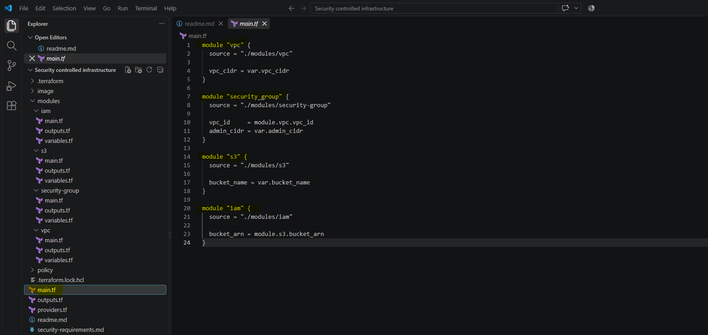

---

## Step 7 — Initialize and Validate Terraform

From the project root:

```powershell
terraform init
```

Terraform initializes the provider and local modules.

Then format the entire project:

```powershell
terraform fmt -recursive
```

Finally validate the configuration:

```powershell
terraform validate
```

Expected result:

```text
Success! The configuration is valid.
```
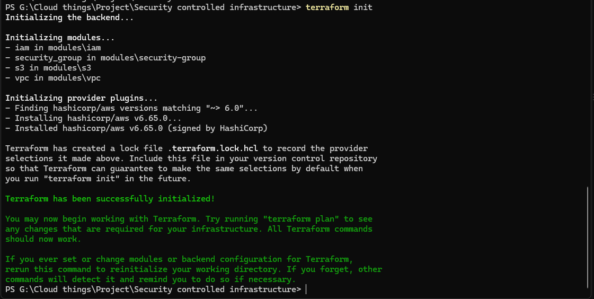
---

## Phase 2 Result

At the end of Phase 2, the project has:

```text
Reusable Terraform Modules
        ↓
VPC
Security Group
IAM
S3
        ↓
Root Module Composition
        ↓
terraform validate
        ↓
Valid Terraform Configuration
```
---

# Phase 3 — Deploy Infrastructure Using the Modules

## Objective

The goal of this phase is to use the reusable Terraform modules created in Phase 2 to provision the security-controlled infrastructure in AWS.

The deployment process follows:

```text
Terraform Variables
        ↓
Terraform Plan
        ↓
Review Planned Changes
        ↓
Terraform Apply
        ↓
AWS Infrastructure
        ↓
Verify Deployment
```

---

## Step 1 — Define Deployment Variables

Create `terraform.tfvars` in the project root.

```hcl
aws_region  = "ap-southeast-1"
vpc_cidr    = "10.0.0.0/16"
admin_cidr  = "10.0.0.0/16"
bucket_name = "security-controlled-iac-<unique-name>"
```

The variables provide environment-specific values without hard-coding them into the Terraform modules.  
The S3 bucket name must be globally unique and follow AWS S3 bucket naming requirements.

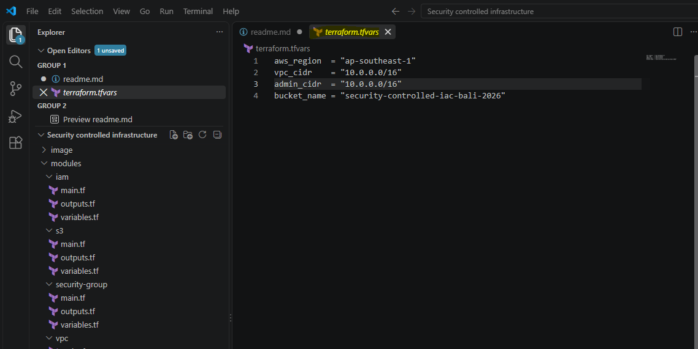
---

## Step 2 — Format and Validate the Configuration

Run:

```powershell
terraform fmt -recursive
```

Then:

```powershell
terraform validate
```

Expected:

```text
Success! The configuration is valid.
```

This ensures the Terraform configuration is correctly formatted and structurally valid before generating the deployment plan.

---

## Step 3 — Generate the Terraform Plan

Create a saved execution plan:

```powershell
terraform plan -out=tfplan
```

Terraform calculates the changes required to make AWS match the configuration without actually modifying the environment.

The plan was reviewed before deployment to verify:

```text
VPC
Security Group
S3 Bucket
S3 Encryption Configuration
IAM Role
IAM Role Policy
```

The Security Group plan was also checked to ensure SSH was restricted to the configured trusted CIDR.

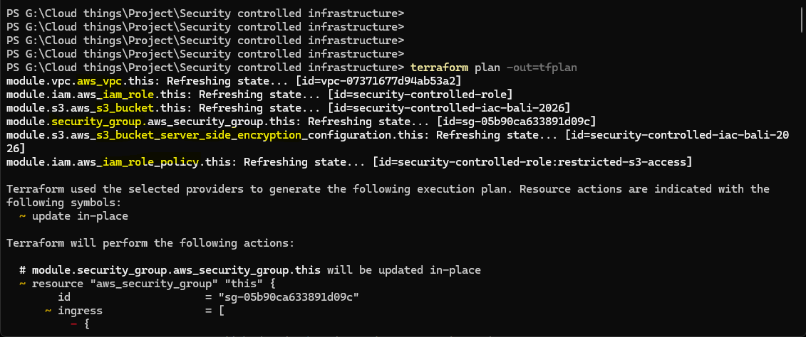
---

## Step 4 — Review the Terraform Plan

Before applying the plan, verify the important security settings.

### Security Group

```text
TCP/22 → trusted CIDR
```

and not:

```text
TCP/22 → 0.0.0.0/0
```

### IAM

The policy should use specific permissions such as:

```text
s3:GetObject
```

rather than:

```text
Action   = "*"
Resource = "*"
```

### S3

The plan should include the server-side encryption configuration.  
This review establishes a security checkpoint before deployment.

---

## Step 5 — Deploy the Infrastructure

After reviewing the plan:

```powershell
terraform apply tfplan
```

Using the saved plan means Terraform applies the **exact plan that was reviewed**.

Expected result:

```text
Apply complete!
```


---

## Step 6 — Verify Terraform Outputs

Run:

```powershell
terraform output
```

The project should return values such as:

```text
vpc_id
security_group_id
bucket_arn
iam_role_arn
```

These outputs allow the deployed resources to be referenced without manually looking up their IDs.

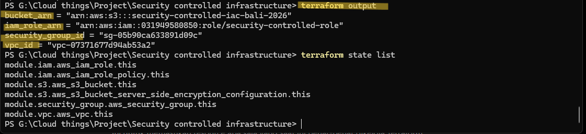

---

## Step 7 — Verify Infrastructure in AWS

The deployment was independently verified in the AWS Console.

### VPC

Verify:

```text
security-controlled-vpc
CIDR: 10.0.0.0/16
```

### Security Group

Verify:

```text
SSH / TCP 22
Source: trusted CIDR
```

### S3

Verify:

```text
Bucket exists
Server-side encryption enabled
```

### IAM

Verify:

```text
security-controlled-role
restricted-s3-access
```
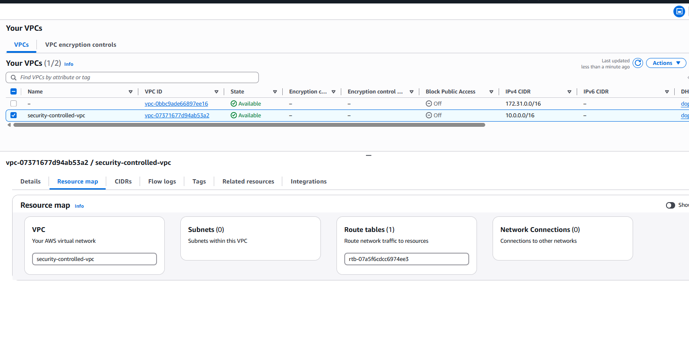
---
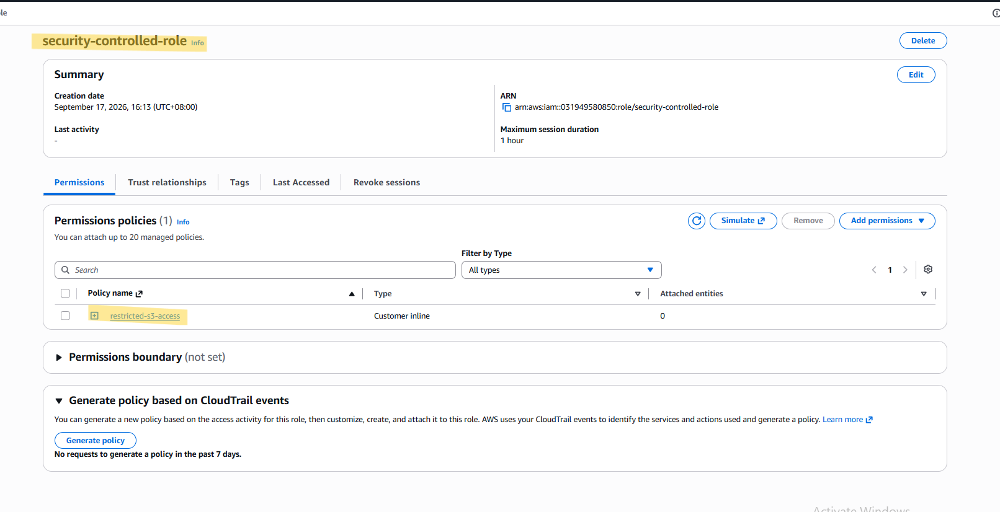
---
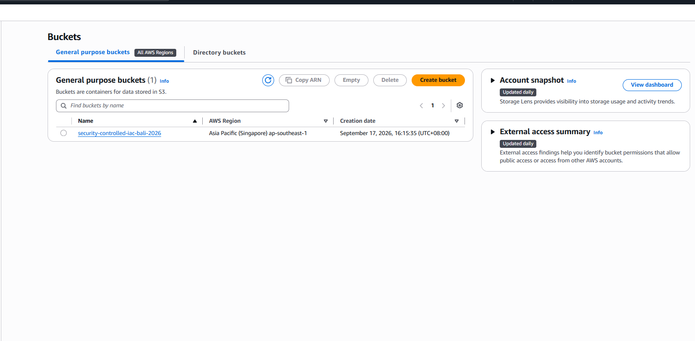
---

## Step 8 — Verify Terraform State

Run:

```powershell
terraform state list
```

The final state contains six managed resources:

```text
module.iam.aws_iam_role.this
module.iam.aws_iam_role_policy.this
module.s3.aws_s3_bucket.this
module.s3.aws_s3_bucket_server_side_encryption_configuration.this
module.security_group.aws_security_group.this
module.vpc.aws_vpc.this
```

This confirms that Terraform is managing the deployed infrastructure.


---

## Phase 3 Result

The reusable modules were successfully used to provision the AWS environment:

```text
Terraform Modules
        ↓
Terraform Plan
        ↓
Security Review
        ↓
Terraform Apply
        ↓
AWS Infrastructure
        ↓
Terraform State
```

The infrastructure was successfully deployed and verified in both Terraform and AWS.

# Phase 4 — Implement Policy Enforcement

## Objective

The goal of this phase is to introduce **Policy as Code** so that Terraform infrastructure can be checked against security requirements before deployment.

The project uses **Conftest**, which runs **OPA/Rego policies**, to evaluate the Terraform plan.

The workflow becomes:

```text
Terraform Plan
      ↓
Terraform Plan JSON
      ↓
Conftest
      ↓
OPA / Rego Policies
      ↓
PASS ✅ / FAIL ❌
```

The three security controls implemented are:

```text
1. Block public SSH
2. Block excessive IAM permissions
3. Require S3 server-side encryption
```

---

## Step 1 — Install and Verify Conftest

Go to github Repo : `open-policy-agent`


---
And then go to `Releases` and choose the right OS you're using.


---

Conftest was installed on Windows and added to the system `PATH`.

```
Start
→ Environment Variables
→ Edit the system environment variables
→ Environment Variables
→ Path
→ Edit
→ New
```

---
Verify the installation:

```powershell
conftest --version
```

The environment used for this project returned:

```text
Conftest: 0.70.0
OPA: 1.20.2
```

Conftest was selected because it provides a convenient CLI for evaluating configuration files using OPA/Rego policies.


---

## Step 2 — Generate Terraform Plan JSON

The Terraform execution plan was converted into JSON so that Conftest could evaluate it.

First, create the plan:

```powershell
terraform plan -out=tfplan
```

Then convert it:

```cmd
cmd /c "terraform show -json tfplan > tfplan.json"
```

`tfplan.json` becomes the input for Conftest.

```text
Terraform Plan
      ↓
   tfplan
      ↓
Terraform JSON
      ↓
 tfplan.json
      ↓
Conftest
```

A `cmd /c` command was used because PowerShell initially generated the JSON with an encoding that Conftest could not parse correctly.


---

## Step 3 — Create the Policy Directory

Create:

```text
policy/
```

The final structure is:

```text
policy/
├── security_group.rego
├── iam.rego
└── s3.rego
```

These files contain the custom security rules written in Rego.


---

## Step 4 — Create Security Group Policy

Create:

```text
policy/security_group.rego
```

The policy checks whether SSH is exposed publicly.

```rego
package terraform.security_group

deny contains msg if {
    resource := input.resource_changes[_]

    resource.type == "aws_security_group"

    ingress := resource.change.after.ingress[_]

    ingress.from_port <= 22
    ingress.to_port >= 22
    ingress.protocol == "tcp"

    cidr := ingress.cidr_blocks[_]

    cidr == "0.0.0.0/0"

    msg := "SSH (TCP/22) must not be exposed to 0.0.0.0/0"
}
```

The rule translates the Phase 1 requirement into executable policy:

```text
TCP/22 + 0.0.0.0/0
          ↓
        DENY
```

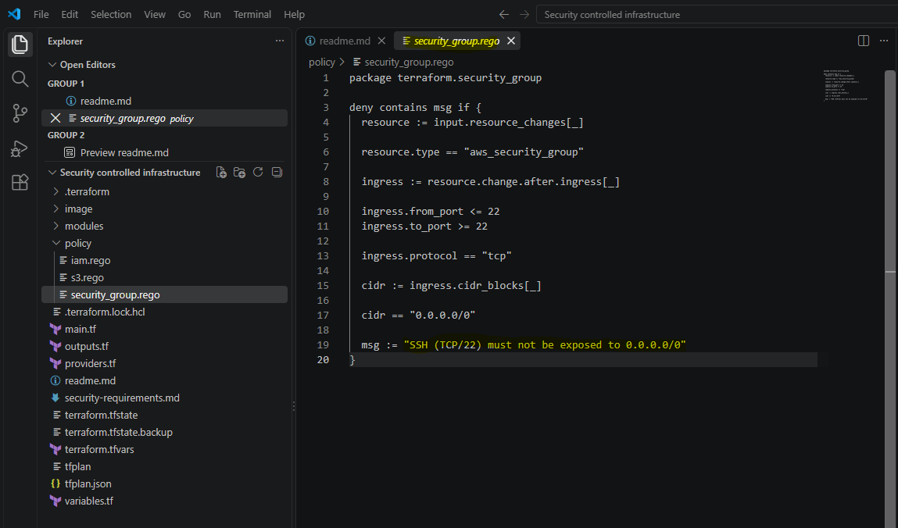
---

## Step 5 — Create IAM Policy

Create:

```text
policy/iam.rego
```

The policy rejects unrestricted IAM permissions:

```rego
package terraform.iam

deny contains msg if {
    resource := input.resource_changes[_]

    resource.type == "aws_iam_role_policy"

    policy := json.unmarshal(resource.change.after.policy)

    statement := policy.Statement[_]

    statement.Effect == "Allow"
    statement.Action == "*"
    statement.Resource == "*"

    msg := "IAM policy must not allow Action '*' with Resource '*'"
}
```

The policy detects:

```text
Effect = Allow
Action = "*"
Resource = "*"
       ↓
      DENY
```

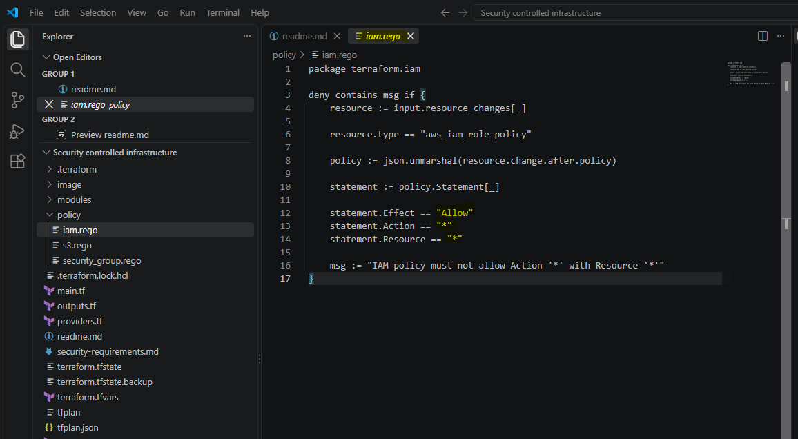
---

## Step 6 — Create S3 Encryption Policy

Create:

```text
policy/s3.rego
```

The policy verifies that an S3 bucket has a corresponding encryption configuration and that the configuration is not being deleted.

```rego
package terraform.s3

deny contains msg if {
    some bucket in input.resource_changes

    bucket.type == "aws_s3_bucket"

    not encryption_configured(bucket.address)

    msg := "S3 bucket must have server-side encryption configured"
}

encryption_configured(bucket_address) if {
    some resource in input.resource_changes

    resource.type == "aws_s3_bucket_server_side_encryption_configuration"

    resource.address == sprintf(
        "%s.%s",
        [replace(bucket_address, "aws_s3_bucket", "aws_s3_bucket_server_side_encryption_configuration"), "this"]
    )

    not contains(resource.change.actions, "delete")
}
```

The policy checks the relationship between:

```text
aws_s3_bucket
        +
aws_s3_bucket_server_side_encryption_configuration
```

This was necessary because the Terraform plan represents the bucket and its encryption configuration as separate resources.

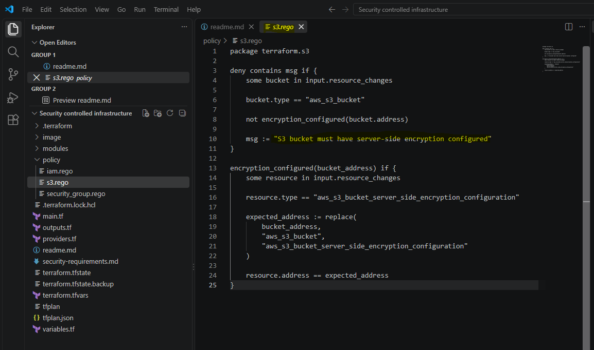
---

## Step 7 — Run the Policies

Run:

```powershell
conftest test tfplan.json --policy policy --all-namespaces
```

The `--all-namespaces` option is important because our policies are organized under different Rego packages:

```text
terraform.security_group
terraform.iam
terraform.s3
```

The initial test without `--all-namespaces` resulted in:

```text
0 tests
```

because Conftest did not evaluate the custom namespaces by default.

After using `--all-namespaces`:

```text
3 tests, 3 passed
```

---

## Step 8 — Validate the Policy Enforcement Workflow

At the end of Phase 4, the complete security validation flow is:

```text
Terraform Configuration
          ↓
Terraform Plan
          ↓
      tfplan.json
          ↓
       Conftest
          ↓
 ┌────────┼─────────┐
 ↓        ↓         ↓
SG       IAM       S3
Policy   Policy    Policy
 └────────┼─────────┘
          ↓
      3 Tests
          ↓
      3 Passed ✅
```

At this stage, the infrastructure is considered compliant with the **custom security requirements**.

---

## Phase 4 Troubleshooting

Two troubleshooting issues are worth documenting because they demonstrate practical experience.

### 1. PowerShell JSON Encoding

Initial generation of `tfplan.json` caused Conftest to return an invalid-character error.

Resolution:

```cmd
cmd /c "terraform show -json tfplan > tfplan.json"
```

This generated JSON in a format Conftest could parse correctly.

### 2. Conftest Namespace

Initial command:

```powershell
conftest test tfplan.json --policy policy
```

returned:

```text
0 tests
```

Resolution:

```powershell
conftest test tfplan.json --policy policy --all-namespaces
```

Result:

```text
3 tests, 3 passed
```

---

## Phase 4 Result

The project now has a functioning **Policy as Code security layer**:

```text
Security Requirements
        ↓
Rego Policies
        ↓
Conftest / OPA
        ↓
Terraform Plan
        ↓
Security Validation
```

# Phase 5 — Test With Intentional Misconfigurations

## Objective

The goal of this phase is to verify that the security policies created in Phase 4 can **actually detect insecure Terraform configurations**.

Instead of only testing a secure configuration that returns `PASS`, each security control is intentionally violated one at a time.

The misconfigurations are **never applied to AWS**. They are introduced only into the Terraform configuration, converted into a plan, and evaluated by Conftest.

```text
Secure Configuration
        ↓
Temporary Misconfiguration
        ↓
terraform plan
        ↓
tfplan.json
        ↓
Conftest
        ↓
FAIL ❌
        ↓
Restore Secure Configuration
```

---

## Step 1 — Test Public SSH Exposure

The first test intentionally violates the Security Group requirement.

### Change the configuration

In `terraform.tfvars`, temporarily change:

```hcl
admin_cidr = "0.0.0.0/0"
```

This creates a Security Group rule allowing SSH from anywhere.

### Generate a new plan

```powershell
terraform plan -out=tfplan
```

Do **not** run `terraform apply`.

### Convert the plan to JSON

```cmd
cmd /c "terraform show -json tfplan > tfplan.json"
```

### Run Conftest

```powershell
conftest test tfplan.json --policy policy --all-namespaces
```

Expected result:

```text
3 tests, 2 passed, 1 failure
```

The failure should identify:

```text
SSH (TCP/22) must not be exposed to 0.0.0.0/0
```

This proves the Security Group policy can detect public SSH exposure before deployment.


---

### Restore the configuration

Change back to:

```hcl
admin_cidr = "10.0.0.0/16"
```

---

## Step 2 — Test Excessive IAM Permissions

The second test intentionally creates an overly permissive IAM policy.

### Modify the IAM module

In:

```text
modules/iam/main.tf
```

temporarily change the policy to:

```hcl
Action   = "*"
Resource = "*"
```

This creates the prohibited pattern:

```json
{
  "Effect": "Allow",
  "Action": "*",
  "Resource": "*"
}
```

### Generate a new plan

```powershell
terraform plan -out=tfplan
```

Again, do **not** apply the plan.

### Generate JSON

```cmd
cmd /c "terraform show -json tfplan > tfplan.json"
```

### Run Conftest

```powershell
conftest test tfplan.json --policy policy --all-namespaces
```

Expected:

```text
3 tests, 2 passed, 1 failure
```

The failure should identify:

```text
IAM policy must not allow Action '*' with Resource '*'
```


---

### Restore the IAM configuration

Return it to:

```hcl
Action = [
  "s3:GetObject"
]

Resource = "${var.bucket_arn}/*"
```

---

## Step 3 — Test Missing S3 Encryption

The third test intentionally removes the required S3 encryption configuration.

### Temporarily remove encryption

In:

```text
modules/s3/main.tf
```

temporarily remove or comment out:

```hcl
resource "aws_s3_bucket_server_side_encryption_configuration" "this" {
  ...
}
```

This creates a plan where the encryption configuration is being removed.

### Generate the plan

```powershell
terraform plan -out=tfplan
```

### Generate JSON

```cmd
cmd /c "terraform show -json tfplan > tfplan.json"
```

### Run Conftest

```powershell
conftest test tfplan.json --policy policy --all-namespaces
```

Expected:

```text
3 tests, 2 passed, 1 failure
```

The failure should identify:

```text
S3 bucket must have server-side encryption configured
```


---

### Restore S3 encryption

Put the encryption resource back into:

```text
modules/s3/main.tf
```

---

## Step 4 — Final Secure Validation

After all three negative tests, restore the project to its original secure configuration.

Run:

```powershell
terraform plan -out=tfplan
```

Then:

```cmd
cmd /c "terraform show -json tfplan > tfplan.json"
```

Finally:

```powershell
conftest test tfplan.json --policy policy --all-namespaces
```

Expected:

```text
3 tests, 3 passed
```

This proves that the project returns to a compliant state after the intentional misconfigurations are removed.


---

## Step 5 — Security Test Summary

The results can be documented as:

| Security Test              | Intentional Violation         | Expected Result | Result     |
| -------------------------- | ----------------------------- | --------------- | ---------- |
| Security Group             | SSH → `0.0.0.0/0`             | FAIL            | ✅ Detected |
| IAM                        | `Action="*"` + `Resource="*"` | FAIL            | ✅ Detected |
| S3                         | Encryption removed            | FAIL            | ✅ Detected |
| Final Secure Configuration | No violation                  | PASS            | ✅ Passed   |

The important concept demonstrated here is:

> **A security policy is only useful if it can detect a violation, not merely pass a compliant configuration.**

---

## Phase 5 Result

The three custom security policies were intentionally tested against insecure Terraform configurations.

```text
Public SSH
    ↓
FAIL ✅

Excessive IAM Permissions
    ↓
FAIL ✅

Missing S3 Encryption
    ↓
FAIL ✅

Restore Secure Configuration
    ↓
3 tests, 3 passed ✅
```

This provides evidence that the Conftest policies function as **preventive security controls before infrastructure deployment**.

---

# Phase 6 — Final Security-Controlled Deployment

## Objective

The goal of this final phase is to combine the Terraform deployment workflow with the **security policy validation layer** built in the previous phases.

Terraform infrastructure is only applied after the Terraform plan passes all custom security policies.

```text
Terraform Configuration
        ↓
Terraform Plan
        ↓
Convert Plan → JSON
        ↓
Conftest / OPA
        ↓
3 Policies PASS ✅
        ↓
Apply Approved Plan
        ↓
AWS Infrastructure
        ↓
Verify Terraform State & AWS
```

This creates a simple **security-controlled deployment workflow**.

---

## Step 1 — Confirm Secure Configuration

Before generating the final deployment plan, all intentional misconfigurations from Phase 5 were restored.

### Security Group

```hcl
admin_cidr = "10.0.0.0/16"
```

### IAM

```hcl
Action = [
  "s3:GetObject"
]

Resource = "${var.bucket_arn}/*"
```

### S3

Server-side encryption configuration was restored.

The project was therefore returned to its secure baseline.

---

## Step 2 — Generate the Final Terraform Plan

Create the final execution plan:

```powershell
terraform plan -out=tfplan
```

Because the infrastructure had already been deployed and the configuration was unchanged, Terraform reported no infrastructure changes.

```text
Plan: 0 to add, 0 to change, 0 to destroy
```

This confirms that the deployed AWS infrastructure matches the current Terraform configuration.

---

## Step 3 — Convert the Plan to JSON

Convert the plan into a machine-readable format:

```cmd
cmd /c "terraform show -json tfplan > tfplan.json"
```

The resulting file:

```text
tfplan.json
```

is used as the input for Conftest.

---

## Step 4 — Run the Security Gate

Run the complete security policy suite:

```powershell
conftest test tfplan.json --policy policy --all-namespaces
```

Expected result:

```text
3 tests, 3 passed
```

The three controls are:

```text
Security Group → PASS
IAM             → PASS
S3 Encryption   → PASS
```

Only after this security validation succeeds should the plan be applied.

The security gate therefore works as:

```text
Conftest
   ↓
PASS ✅ → Continue
FAIL ❌ → Stop
```
---

## Step 5 — Apply the Approved Terraform Plan

Once the security validation passed:

```powershell
terraform apply tfplan
```

Using the saved plan ensures that Terraform applies the **same plan that was reviewed and validated by Conftest**.

Expected result:

```text
Apply complete!
```

No new infrastructure changes were required because the environment was already deployed and compliant.


---

Together they demonstrate:

```text
Security Validation
        ↓
PASS ✅
        ↓
Approved Plan
        ↓
Terraform Apply
```

---

## Step 6 — Verify Terraform Outputs

Run:

```powershell
terraform output
```

The deployment returns:

```text
vpc_id
security_group_id
bucket_arn
iam_role_arn
```

These outputs confirm that Terraform can reference the deployed resources successfully.

---

## Step 7 — Verify Terraform State

Run:

```powershell
terraform state list
```

The final Terraform state contains six managed resources:

```text
module.iam.aws_iam_role.this
module.iam.aws_iam_role_policy.this
module.s3.aws_s3_bucket.this
module.s3.aws_s3_bucket_server_side_encryption_configuration.this
module.security_group.aws_security_group.this
module.vpc.aws_vpc.this
```

This confirms that the infrastructure remains under Terraform management.


---

## Step 8 — Verify AWS Resources

The deployed infrastructure was also verified through the AWS Console.

The following resources were confirmed:

```text
VPC
Security Group
S3 Bucket
S3 Encryption Configuration
IAM Role
IAM Role Policy
```

The security-related configurations were also verified:

```text
SSH → restricted CIDR
IAM → restricted S3 permission
S3 → server-side encryption enabled
```
---

# Final Security-Controlled Workflow

The completed workflow is:

```text
              Terraform Code
                    ↓
            Reusable Modules
                    ↓
             Terraform Plan
                    ↓
              Plan → JSON
                    ↓
             Conftest / OPA
                    ↓
          ┌─────────┴─────────┐
          ↓                   ↓
       PASS ✅             FAIL ❌
          ↓                   ↓
   terraform apply          STOP
          ↓
    AWS Infrastructure
          ↓
 Terraform State + AWS Verification
```

This demonstrates a **preventive IaC security workflow** rather than relying only on security checks after deployment.

---

## Phase 6 Result

The final deployment successfully passed all three security policies before the approved Terraform plan was applied.

```text
Security Group Policy → PASS
IAM Policy            → PASS
S3 Encryption Policy  → PASS

Terraform Apply       → Successful
Terraform State       → 6 resources managed
AWS Verification      → Successful
```

---

## Project Outcome

## What Was Built

This project implemented a security-controlled Terraform architecture consisting of:

```text
Reusable Terraform Modules
        +
Security Requirements
        +
Policy as Code
        +
OPA / Rego
        +
Conftest
        +
Negative Security Testing
        +
Controlled Deployment
```

## Security Controls

The final solution enforces three preventive controls:

| Control        | Policy                              |
| -------------- | ----------------------------------- |
| Security Group | Block SSH from `0.0.0.0/0`          |
| IAM            | Block `Action="*"` + `Resource="*"` |
| S3             | Require server-side encryption      |

## Key Lessons

### 1. Reusable modules can standardize security

Security requirements can be built directly into reusable Terraform modules instead of relying entirely on developers to configure resources correctly each time.

### 2. Policy as Code makes security testable

Security requirements become executable rules that can return:

```text
PASS ✅
FAIL ❌
```

rather than remaining only as documentation.

### 3. Negative testing matters

A policy that only produces `PASS` has not necessarily been proven effective.

The project deliberately tested:

```text
Public SSH           → FAIL
Excessive IAM        → FAIL
Missing S3 Encryption → FAIL
Secure configuration → PASS
```

### 4. Plan validation should happen before Apply

The final workflow validates the **Terraform plan** before applying it:

```text
Plan
 ↓
Security Gate
 ↓
Apply
```

This is the central security concept demonstrated by the project.

---

## Project Limitations

The security gate in this project is currently executed **manually**:

```text
terraform plan
        ↓
conftest
        ↓
terraform apply
```

A developer could technically bypass Conftest and run `terraform apply` directly.

For a production environment, this control would typically be integrated into a **CI/CD pipeline** where the deployment process automatically blocks an unapproved plan.

That is intentionally outside the scope of this project.

---

## Final Project Summary

> **Security-Controlled Infrastructure Deployment with Terraform & Conftest** demonstrates how Infrastructure as Code can move from simply provisioning resources to actively enforcing security requirements before deployment.

The project progresses from:

```text
Define Security Requirements
        ↓
Build Reusable Modules
        ↓
Deploy Infrastructure
        ↓
Implement Policy as Code
        ↓
Test Security Violations
        ↓
Security-Controlled Deployment
```
---

